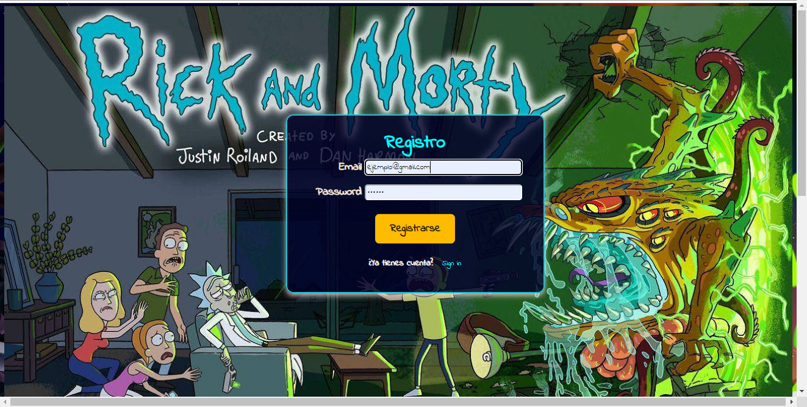
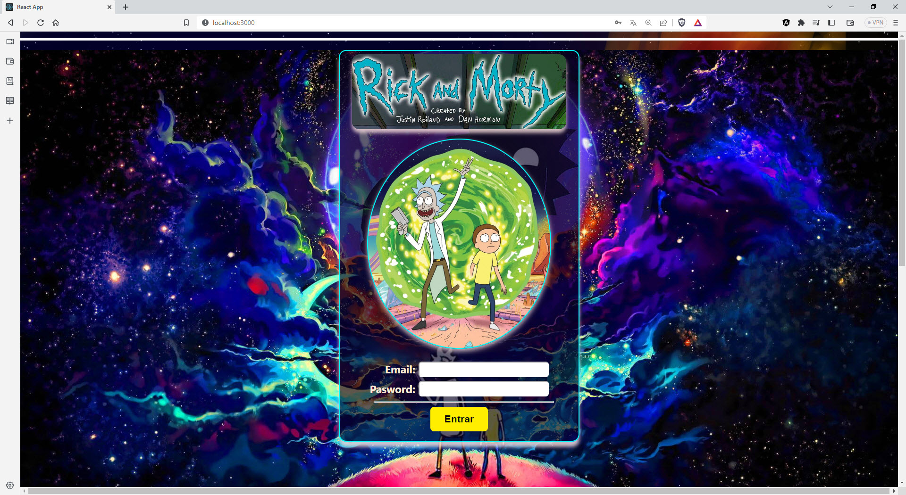
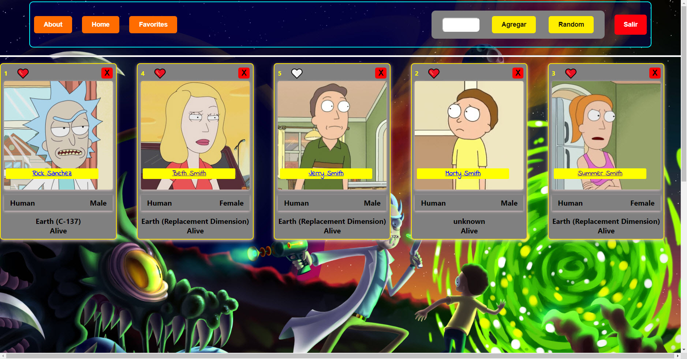
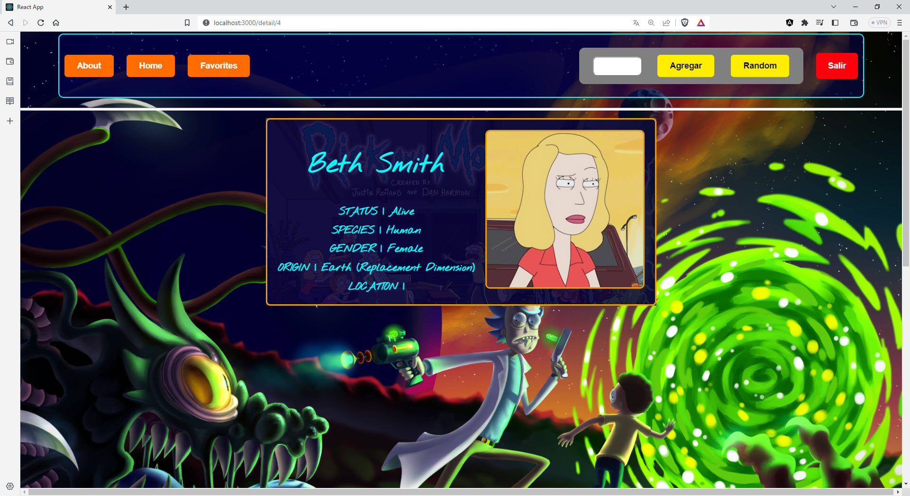

# **Rick and Morty React App🚀**

## **¡Wubba lubba dub dub! 🛸🔬**

<br />

---
## **📝 INTRODUCCIÓN**

Esta es una aplicación basada en la serie "Rick and Morty". Fue desarrollada como parte de mi portafolio como Full Stack Web Developer, y utiliza tecnologías como React⚛️, Redux⚡️, Node.js🚀, Express🌐, Sequelize🗄️ y PostgreSQL🐘. La aplicación tiene como objetivo proporcionar a los usuarios información sobre los personajes y ubicaciones de la serie "Rick and Morty".  Los usuarios pueden explorar la serie, buscando personajes y obtener detalles sobre ellos.

<br />

---
## **Tecnologias utilizadas💻**

**Frontend:**

- React ⚛️: Biblioteca JavaScript para construir la interfaz de usuario.
- Redux ⚡️: Gestión del estado de la aplicación.
- HTML y CSS 🎨: Estructura y estilizado de la aplicación.

**Backend:**

- Node.js 🚀: Entorno de ejecución de JavaScript en el servidor.
- Express 🌐: Marco de aplicación web para Node.js.
- PostgreSQL 🐘: Sistema de gestión de bases de datos relacionales.
- Sequelize 🗄️: ORM (Mapeo Objeto-Relacional) para interactuar con la base de datos.
<br />

---

## **📋 Caracteristicas**

En esta aplicación, he aplicado varias tecnologías y conceptos interesantes:

   - **`Estado y Ciclo de Vida (State & Lifecycle)`**: Utilicé el estado local (state) de React para almacenar y manipular los datos necesarios en los componentes. Además, aproveché los ciclos de vida de los componentes para realizar tareas específicas en momentos determinados, como la carga inicial de datos.
   - **`Enrutamiento (Routing)`**: mplementé enrutamiento utilizando React Router para navegar entre diferentes páginas y mostrar componentes específicos según la URL actual.
   - **`Formularios (Forms)`**: Diseñé un formulario interactivo para permitir a los usuarios hacer un login para ingresar a la App. Utilicé la gestión de estado local para manejar los datos ingresados por el usuario y ejecutar acciones en consecuencia.
   - **`Redux`**: Utilicé Redux para la gestión del estado global de la aplicación. Implementé acciones, reducers y el store de Redux para manejar el estado compartido entre los diferentes componentes.
   - **`Hooks`**: Hice uso extensivo de los Hooks de React, como useState, useEffect y useDispatch, para gestionar el estado local de los componentes, realizar efectos secundarios y enviar acciones a Redux.
   - **`CSS`**: Utilicé CSS Modules para dar estilo a la aplicación y crear una interfaz atractiva y amigable para el usuario. Aplicando los principios de responsive
   - **`Node.js`** 🚀: Node.js es un entorno de ejecución de JavaScript basado en el motor V8 de Chrome. Permite ejecutar código JavaScript en el lado del servidor, lo que facilita la creación de aplicaciones web escalables y de alto rendimiento. Node.js utiliza un enfoque orientado a eventos y no bloqueante, lo que lo hace ideal para aplicaciones en tiempo real y API.
   - **`Express`** 🌐: Express es un marco de aplicación web minimalista para Node.js. Proporciona una capa de abstracción sobre HTTP, lo que facilita la creación de API y la gestión de rutas, solicitudes y respuestas. Express es conocido por su simplicidad y flexibilidad, lo que permite a los desarrolladores crear rápidamente aplicaciones web robustas.
   - **`Sequelize`** 🗄️: Sequelize es un ORM (Object-Relational Mapping) para Node.js. Proporciona una forma sencilla de interactuar con bases de datos relacionales, como PostgreSQL. Sequelize permite definir modelos de datos en forma de clases JavaScript, lo que simplifica la manipulación de datos y la realización de consultas utilizando el lenguaje de consulta estructurado (SQL).
   - **`PostgreSQL`** 🐘: PostgreSQL es un sistema de gestión de bases de datos relacionales de código abierto y altamente confiable. Es conocido por su robustez, escalabilidad y capacidad de adaptación a diversas necesidades empresariales. PostgreSQL soporta una amplia variedad de características avanzadas, como consultas complejas, transacciones ACID y soporte para tipos de datos especiales.

<br />

---

### **Capturas de pantalla**
Aqui tienes algunas capturas de pantalla de la aplicación:

<br />

**Formulario para registrarse en la App**


<br />

**Formulario para ingresar a la App**



<br />

**Barra de navegación**


<br />

**Presentación de las Cards**



<br />

**Detalles del personaje**



### **¿Cómo ejecutar la aplicación?**
<br />

**Instalación:**

1. Clona este repositorio en tu máquina local.
   ```bash
   git clone https://github.com/jacapera/Rick_and_Morty.git
   ```
2. Instala las dependencias del frontend:
   ```bash
   cd Client && npm install
   ```
3. Instala las dependencias del backend:
   ```bash
   cd Server && npm install
   ```
4. Configura la base de datos PostgresSQL y actualiza las credenciales en el archivo
   ```bash
   .env
   DB_USER=
   DB_PASSWORD=
   DB_HOST=
   DB_PORT=
   ```
5. Ejecuta el frontend:
   ```bash
   cd Client && npm start
   ```
6. Ejecuta el backend:
   ```bash
   cd Server && npm start
   ```

## Agradecimientos
¡Un agradecimiento especial a Rick Sanchez y Morty Smith por inspirar esta aplicación! 🙌

## Recursos adicionales
- [Documentación de React(en español)](https://es.react.dev/)
- [Documentación de Redux(en español)](https://es.redux.js.org/)
- [Documentación de React Router](https://reactrouter.com/en/dev)


¡Diviértete explorando el multiverso de Rick and Morty! 🚀🌌

